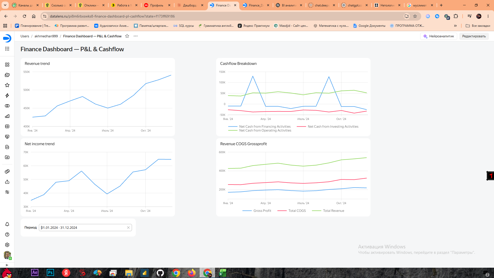
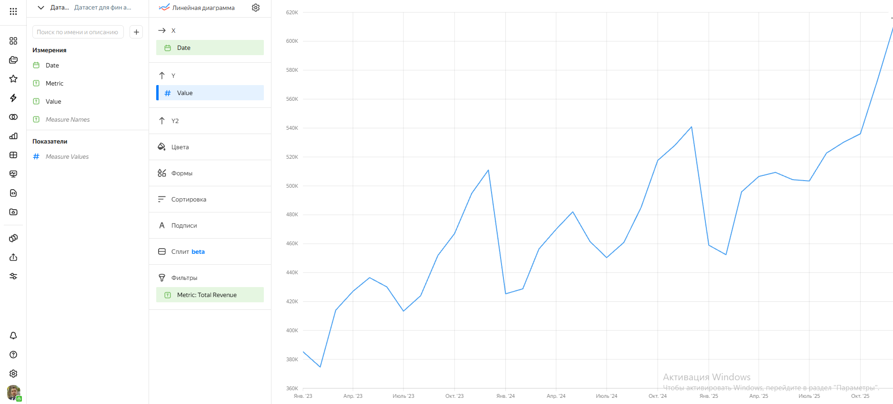
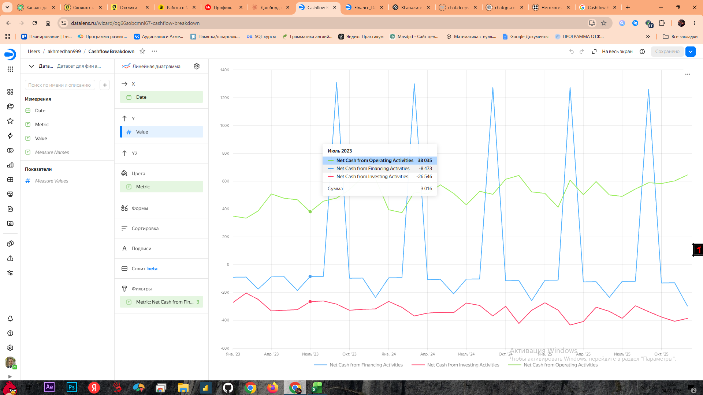
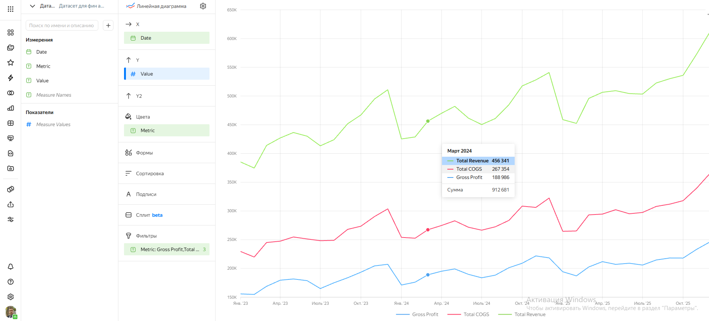

# 📊 Financial P&L & Cashflow Analysis: Excel → Yandex DataLens

Сквозной пайплайн финансовой аналитики: от сырых данных и формул в Excel до интерактивного дашборда в Yandex DataLens.

**🔗 Live-дашборд:** [Открыть в DataLens](ССЫЛКА_НА_ПУБЛИЧНЫЙ_ДАШБОРД_СЮДА)

---

## О проекте

Финансовая модель условной компании (Retail, Wholesale, E-commerce) за 2023–2025 гг.:
консолидированный P&L, отчёт о движении денежных средств (Cashflow) и годовые KPI —
всё построено на формулах в Excel, а затем визуализировано в DataLens в виде
интерактивного дашборда с фильтром по периоду.

**Стек:** Excel (openpyxl, SUMIFS, кросс-листовые формулы) → Google Sheets → Yandex DataLens

## Что внутри

| Папка | Содержимое |
|---|---|
| `excel/` | Полная Excel-модель со всеми формулами (Raw_Data → P&L → Cashflow → KPI → DataLens_Export) |
| `data/` | Сырые данные в CSV (для воспроизведения / загрузки в BI-инструмент) |
| `screenshots/` | Скриншоты дашборда и отдельных чартов |
| `docs/methodology.md` | Допущения, структура формул, логика связи P&L и Cashflow |

## Структура Excel-модели

1. **Raw_Data** — ~1780 строк: помесячные суммы по бизнес-юнитам, статьям (Revenue/COGS/Opex/CF) и подкатегориям
2. **P&L_Statement** — консолидированный P&L помесячно (36 месяцев), формулы `SUMIFS` из Raw_Data + расчётные строки (Gross Profit, EBITDA, EBIT, Net Income, маржинальность)
3. **Cashflow_Statement** — ОДДС косвенным методом, Net Income и D&A подтягиваются напрямую с листа P&L
4. **KPI_Annual** — годовая сводка и сравнение бизнес-юнитов
5. **DataLens_Export** — плоская таблица (Дата/Метрика/Значение) для выгрузки в BI

Все формулы проверены на 0 ошибок пересчёта (2400+ формул).

## Дашборд в DataLens

4 связанных чарта с единым фильтром по периоду:

| Revenue Trend | Cashflow Breakdown |
|---|---|
|  |  |

| Net Income Trend | Revenue vs COGS vs Gross Profit |
|---|---|
| — |  |

## Как воспроизвести

1. Открой `excel/Finance_PL_Cashflow_Analysis.xlsx` — изучи логику формул (лист `ReadMe` внутри).
2. Загрузи `data/datalens_export.csv` в Google Sheets.
3. В DataLens: Подключение → Google Sheets → Датасет → Wizard-чарт (подробности в `docs/methodology.md`).

## Автор

Ахмедхан Темирбулатов — https://datalens.yandex/pi8m6rbxswks8
